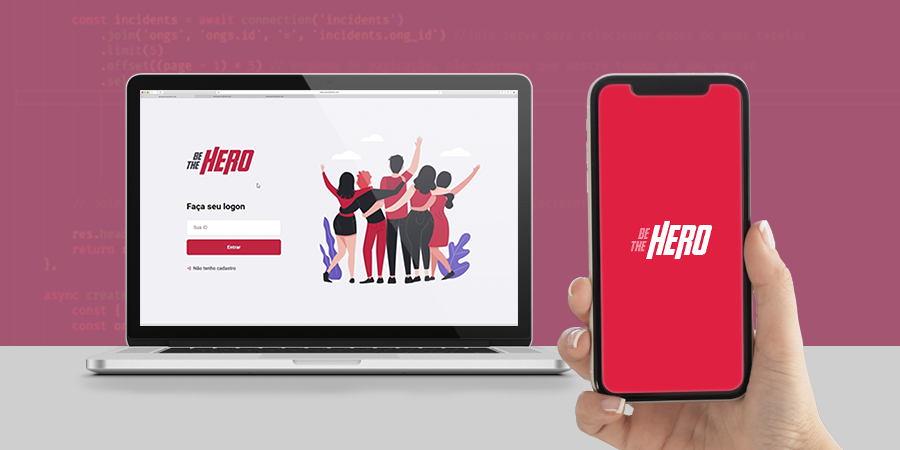

<h2 align="center">
    Be The Hero!
</h2>

 

    

<h4 align="center">
  🚀 Semana OmniStack 11.0
</h4>

  

  <a href="#heart-o-projeto">O projeto</a>&nbsp;&nbsp;&nbsp;|&nbsp;&nbsp;&nbsp;
  <a href="#computer-tecnologias">Tecnologias</a>

 

## :heart: O projeto

Na semana OmniStack 11.0 da Rocketseat fora desenvolvimento o projeto Be The Hero, que tem como objetivo ajudar ONG's financeiramente, compartilhando sua necessidade e a quantia para que o doador possa contribuir.
   
A ONG cria sua conta na aplicação web e cadastra o casos que deseja preenchendo os campos necessários. 
Através da aplicação mobile, os usuários poderão ver casos das ONG's e entrar em contato via e-mail ou Whatsapp, caso possua o interesse de ajudar.

 

## :computer: Tecnologias

Tecnologias utilizadas na aplicação
- [React](https://reactjs.org)
- [Node.js](https://nodejs.org/en/)
- [Express](https://expressjs.com/pt-br/)
- [Knex](http://knexjs.org/)
- [SQLite](https://www.sqlite.org/index.html)
- [Nodemon](https://www.npmjs.com/package/nodemon)
- [Insomnia](https://support.insomnia.rest/)
- [Cors](https://www.npmjs.com/package/cors)
- [React Native](https://facebook.github.io/react-native/)
- [Expo](https://expo.io/)

 
___

  
<h5 align="center">
  :rocket: Semana OmniStack 11.0 desenvolvida por Sthefanne Batista.
</h5>
 
